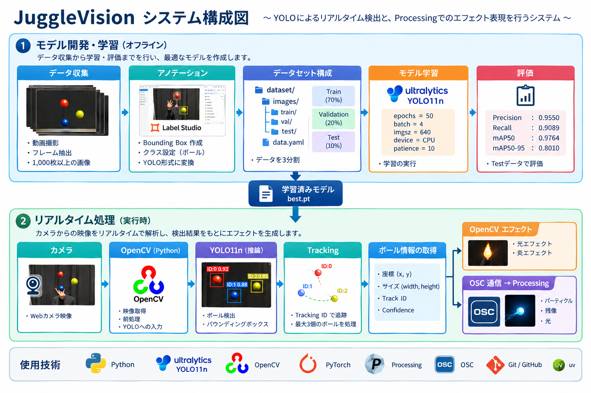

# Generation of Visual Effects for Juggling Balls Using Object Detection

## プロジェクト概要
* 本プロジェクトでは、ジャグリングボールを対象とした物体検出モデルを構築し、リアルタイムで検出した複数のボールにエフェクトを入れることで、インタラクティブアートとしてパフォーマンスでの新たな視覚効果を生成する。

## 使用技術
* Python
* YOLO11n / Ultralytics
* OpenCV
* PyTorch
* Processing
* OSC / OSCP5
* Git / GitHub
* uv

## データセット
* 撮影方法
* 背景・距離などの条件
* ボール3個
* 1000枚以上
* Train / Validation / Testの分割方法
* Label Studioによるアノテーション
* YOLO形式への変換

## システム構成図

   

## モデル学習

   ```text
   YOLO11n
   epochs = 50
   batch = 4
   imgsz = 640
   device = CPU
   patience = 10
   ```

## 評価結果

今回のTest結果：

| 指標        |         結果 |
| --------- | ---------: |
| Precision | **0.9550** |
| Recall    | **0.9089** |
| mAP50     | **0.9764** |
| mAP50-95  | **0.8010** |


## 推論・Tracking

   * YOLOによるリアルタイム検出
   * Tracking IDによるボール追跡
   * 最大3個のボールを処理
   * Bounding Box / 中心座標 / サイズ / Confidenceを取得

## エフェクト

   ```text
   YOLO
    ↓
   ボール検出
    ↓
   Tracking
    ↓
   座標・サイズ
    ↓
   ┌──────────────┐
   │ OpenCV       │ → 光・炎
   │ Processing   │ → パーティクル・残像
   └──────────────┘
   ```

## 実行方法

   * 環境構築
   * 学習
   * 評価
   * リアルタイム検出
   * Processing起動

## 工夫した点

   * カメラとの距離によるボールサイズの変化を考慮
   * ボールの色に依存しない検出
   * 3個のボールを対象としたデータセット設計
   * Trackingによる個々のボールの追跡
   * Bounding Boxのサイズを利用したエフェクトサイズの調整
   * PythonとProcessingをOSCで連携
   * CPU環境での学習を考慮したbatchサイズの調整

## 今後の改善

* 検出精度のさらなる改善
* GPU環境での学習
* より多様な背景・照明条件への対応
